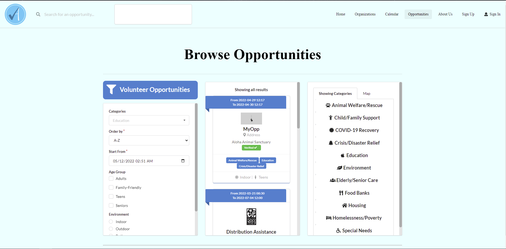

## Overview
This project was made in partner with Volunteer Ally. This application is a platform where users can register to be a volunteer.
The site contains a list of events where users can view the details of the event and sign-up to volunteer. The website also features
a tracking system of all accumulated hours of volunteering and allows organizations to verify those approved hours.