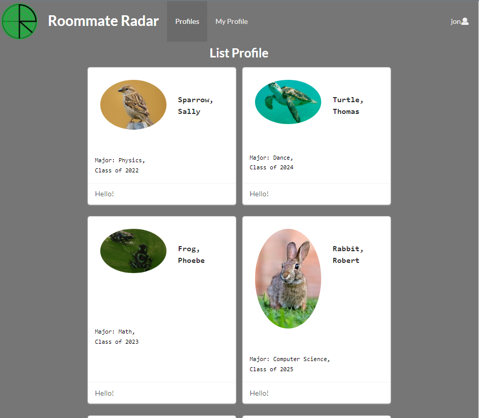

A link to the [Roomate-Radar](https://github.com/roommate-radar) GitHub website.

## Overview
The goal of this project was to create a web application that displays other users who are also looking for roomates. The premise is simple, you create a profile with your information such as what pets do you like or not, or how low/high you are willing to pay for the rent. It is meant to help college students meet up with people that has similar likings during a pandemic crisis. Similar to popular dating applications, it is also meant to give a chance to those people that are more introverted to socialize or even skip the socializing part.

<!-- ## Contributions
I contributed the page where it lists the different profiles to check out. It listed everyone that was registered with the website. I also was in charge of making a filtered page. The purpose was to list only the people that fits the filters you set at the creation of your profile. Unfortunately, I was unable to figure out how to implement that and ended up not finishing that part.

## What I learned
I learned many things from this project ranging from project management to working with a team. It was extremenly confusing at the start and less confusing towards the end. Although this course had lots of action packed web design tutorials and instructions, there are still many things I do not understand about making a website. The creation of a website from scratch requires so much work that it is not possible unless you dedicate almost all of your time and effort as if it was your job. The thing I enjoyed the most out of this project was when our pages started to work together and merged them into the main branch. It was such an accomplishing feeling that you were able to create something with someone as a team.
-->